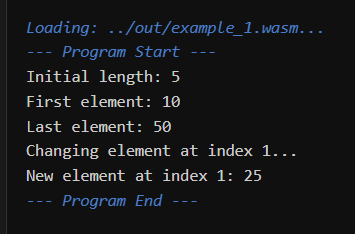

# Отчет (Дополнение по массивам)

## Спецификация функциональности массивов

### Типы данных:
Язык поддерживает одномерные динамические массивы для любого примитивного типа. Синтаксис типа: `<PRIMITIVE_TYPE>[]`.
*   `int[]` — массив целых чисел.
*   `float[]` — массив чисел с плавающей точкой.
*   `bool[]` — массив булевых значений.
*   `str[]` — массив строк.

### Синтаксис операций над массивами:

1.  **Инициализация через литерал**: Создание массива с предопределенным набором элементов. Все элементы должны быть одного типа.
    `<TYPE>[] <VAR_NAME> = [<EXPR_1>, <EXPR_2>, ..., <EXPR_N>];`

2.  **Инициализация с выделением памяти**: Создание массива указанного размера, заполненного значениями по умолчанию (0, 0.0, false, null).
    `<TYPE>[] <VAR_NAME> = new <TYPE>[<SIZE_EXPR>];`

3.  **Доступ к элементу**: Получение или изменение элемента по его индексу. Индексация начинается с нуля. Поддерживаются отрицательные индексы для доступа с конца (`-1` — последний элемент).
    `<ARRAY_EXPR>[<INDEX_EXPR>]`

4.  **Получение среза (slice)**: Создание нового массива, содержащего копию части исходного.
    `<ARRAY_EXPR>[<START_INDEX>:<END_INDEX>]`
    *Примечание: `END_INDEX` не включается в срез. Индексы, выходящие за границы, автоматически и безопасно обрезаются до фактического размера массива.*

5.  **Получение длины**: Свойство, возвращающее текущее количество элементов в массиве.
    `<ARRAY_EXPR>.length`

6.  **Добавление элемента в конец**: Метод, добавляющий элемент в конец массива. Если внутренней емкости недостаточно, происходит автоматическое перераспределение памяти.
    `<ARRAY_EXPR>.append(<ELEMENT_EXPR>);`

7.  **Разворот массива**: Метод, изменяющий исходный массив, располагая его элементы в обратном порядке.
    `<ARRAY_EXPR>.reverse();`

### Операторы над массивами

*   **Сравнение на равенство (`==`, `!=`):** Сравнивают **указатели** (адреса в памяти). Операция возвращает `true` только если две переменные указывают на один и тот же объект в памяти.
*   **Сравнение по длине (`>`, `>=`, `<`, `<=`):** Сравнивают количество элементов в массивах. Типы элементов при этом не учитываются.
*   **Поэлементная арифметика (`+`, `-`, `*`, `/`):** Создают и возвращают **новый массив**, являющийся результатом поэлементного применения операции.
    *   *Требования*: оба операнда — массивы с элементами типа `int` или `float`. Длины массивов должны совпадать (проверяется во время выполнения).
*   **Арифметика со скаляром (`+`, `-`, `*`, `/`):** Создают и возвращают **новый массив**, где операция применена к каждому элементу исходного массива и скаляру.
    *   *Требования*: левый операнд — массив с элементами `int` или `float`, правый — скаляр того же типа.
*   **Арифметические присваивания (`+=`, `-=`, `*=`, `/=`):** Модифицируют **существующий** (левый) массив "на месте".
    *   *Требования*: аналогичны обычной арифметике.

*Примечание: Все арифметические операции (`+`, `-`, `*`, `/` и их вариации с присваиванием) **запрещены** для массивов типа `str[]` и `bool[]` и вызовут семантическую ошибку.*


## Описание изменений в грамматике
(По сравнению с грамматикой, представленной в основном отчете)

### Новые правила

```antlr
// Правило для вызова методов массива (.append, .reverse)
arrayStatement
    : expression DOT APPEND LPAREN expression RPAREN SEMI
    | expression DOT REVERSE LPAREN RPAREN SEMI
    ;
```

### Измененные правила

```antlr
// В `statement` добавлена поддержка операций с массивами.
// И `assignmentStatement` был удален в пользу более общего `expression`.
statement
    : variableDeclaration
    | assignmentStatement // assignmentStatement был заменен более общей логикой
    | ...
    | arrayStatement // Добавлено
    ;

// Правило `expression` значительно расширено для поддержки
// доступа к элементам, срезов и получения длины.
expression
    : atom
    | expression LBRACK expression RBRACK                  // Добавлено: Доступ по индексу
    | expression LBRACK expression COLON expression RBRACK // Добавлено: Создание среза
    | expression DOT LENGTH                                // Добавлено: Получение длины
    ...
    ;

// Правило `atom` теперь включает литералы массивов и оператор `new`.
atom
    : ...
    | LBRACK (expression (COMMA expression)*)? RBRACK // Добавлено: Литерал массива
    | NEW type LBRACK atom RBRACK                     // Добавлено: new type[size]
    ;

// Правило `type` теперь поддерживает объявление типа массива.
type
    : INT | FLOAT | BOOL | STRING
    | type LBRACK RBRACK // Добавлено
    ;
```

### Новые лексемы (токены)

```antlr
LBRACK: '[';       // Квадратные скобки
RBRACK: ']';
COLON: ':';        // Двоеточие для срезов
DOT: '.';          // Точка для доступа к методам/свойствам
NEW: 'new';        // Ключевое слово для выделения памяти
LENGTH: 'length';  // Свойство длины
APPEND: 'append';  // Метод добавления
REVERSE: 'reverse';// Метод разворота
```

## Описание разработанных классов (в контексте массивов)

1.  **`MathPLSemanticAnalyzer`**:
    *   Добавлена поддержка нового типа `ArrayType`.
    *   Реализована проверка типов для литералов массивов (все элементы должны быть одного типа).
    *   Добавлены проверки для операций индексации (база должна быть массивом, индекс — `int`).
    *   Проверяет корректность вызовов методов `.append()` и `.reverse()` и свойства `.length`.

2.  **`WatCodeGenerator`**:
    *   Реализована модель управления памятью в куче (heap) с помощью `malloc`.
    *   Сгенерированы внутренние вспомогательные функции на WAT для операций с массивами: `$slice_i32/f64`, `$append_i32/f64`, `$reverse_i32/f64`, `$normalize_index`, `$check_bounds`.
    *   Добавлена логика генерации кода для создания массивов (`new` и литералы), вычисления смещений для доступа к элементам и вызова вспомогательных функций.

3.  **`MathPLType`**, **`ArrayType`**:
    *   Система типов была расширена классом `ArrayType`, который хранит информацию о типе элементов массива. Это позволяет анализатору корректно работать с вложенными типами, например `int[][]`.

## Перечень генерируемых семантических ошибок

1.  `Array elements must be of the same type` — элементы в литерале массива имеют разные типы (`[1, 2.5]`).
2.  `Array size must be INT` — использование `float` или `str` в качестве размера в `new type[...]`.
3.  `Base of an index operation must be an array type` — попытка использовать `[]` на скалярной переменной.
4.  `Index and slice bounds must be of type INT` — использование `float` или `str` в качестве индекса.
5.  `Method '...' not found for type '...'` — попытка вызвать метод массива у примитивного типа.
6.  `Type mismatch` — попытка присвоить массив одного типа переменной другого типа (`int[] a = float_array;`).
7.  `Cannot compare arrays of different types...` — при сравнении `==` или `!=` типы массивов не совпадают (`int[] == float[]`).
8.  `Operator '...' is not supported for string arrays` — попытка использовать `+`, `-`, `*`, `/` или их `*=` версии с массивами строк.
9.  `Arrays must have the same element type for arithmetic operations` — попытка сложить `int[]` и `float[]`.
10. `Type mismatch for scalar operation...` — тип элементов массива не совпадает с типом скаляра (`int[] * 5.0`).
11. `Scalar must be on the right for array-scalar operations` — скаляр должен быть всегда справа для операций массив-скаляр.

## Перечень генерируемых ошибок времени выполнения (Runtime Errors)
Эти ошибки не могут быть обнаружены на этапе компиляции, так как они зависят от значений, вычисляемых в ходе выполнения программы.

1.  **`Array length mismatch for element-wise operation`** — возникает при попытке выполнить арифметическую операцию (`+`, `-`, `*`, `/`, `+=`, и т.д.) над двумя массивами разной длины.
    *   *Пример:* `[1, 2] + [3, 4, 5];`
2.  **`Division by zero in array operation`** — возникает при поэлементном делении, если один из элементов правого массива равен нулю.
    *   *Пример:* `[10, 20] / [2, 0];`
3.  **`Index out of bounds`** — стандартная ошибка при попытке доступа к элементу по индексу, который меньше 0 или больше либо равен длине массива, после нормализации отрицательных индексов.
## Демонстрация работы компилятора

### Пример 1: Корректный код с массивами

*   **Исходный код (`extra_task_examples/example_1.txt`)**
    ```
    int[] numbers = [10, 20, 30, 40, 50];
    int len = numbers.length;
    print("Initial length: " + (str)len);
    int first = numbers[0];
    int last = numbers[-1];
    print("First element: " + (str)first);
    print("Last element: " + (str)last);
    print("Changing element at index 1...");
    numbers[1] = 25;
    int changed = numbers[1];
    print("New element at index 1: " + (str)changed);

*   **Вывод через `wasm_runner/`**



### Пример 2: Синтаксические ошибки с массивами
*   **Исходный код (`extra_task_examples/syntax_error_examples.txt`)**
    ```
    int[] a = {1, 2, 3};
    float[] b = [1.0, 2.0, 3.0,];
    int c[] = [1, 2, 3];
    int[] d = [1 2 3];
    int[] e = [10, 20];
    int val = e(0);
    int[] f = e[0; 1];
    int[] g = [1];
    int len = g.length();
    g.append 100;
    ```

*   **Вывод компилятора**
    ```
      Starting syntax check for: D:\Uni\SEM7\YAPIS\yapis-2025\avrukevich\compiler\..\examples\extra_task_examples\syntax_error_examples.txt
      Syntax check failed. Errors found:
        SYNTAX ERROR on line 6:12 -> mismatched input ',' expecting ';'
        SYNTAX ERROR on line 10:27 -> mismatched input ']' expecting {'(', '[', 'not', 'new', BOOL_LITERAL, ID, INT_LITERAL, FLOAT_LITERAL, STRING_LITERAL, '++', '--', '-'}
        SYNTAX ERROR on line 14:5 -> mismatched input '[' expecting {';', '='}
        SYNTAX ERROR on line 17:13 -> mismatched input '2' expecting {']', ','}
        SYNTAX ERROR on line 28:13 -> no viable alternative at input '[0;'
        SYNTAX ERROR on line 36:18 -> missing ';' at '('
        SYNTAX ERROR on line 39:9 -> missing '(' at '100'
        SYNTAX ERROR on line 39:12 -> missing ')' at ';'
    ```

### Пример 3: Семантические ошибки с массивами
*   **Исходный код (`extra_task_examples/semantic_error_examples.txt`)**
    ```java

    int[] mismatched_literal = [1, 2, 3.14, 4];

    float[] new_with_float_size = new float[5.0];

    int[] empty_literal = [];

    int scalar_var = 100;
    int[] my_array = [1, 2, 3];

    int invalid_access = scalar_var[0];

    int invalid_index = my_array[1.5];

    int invalid_length = scalar_var.length;

    int[] i_arr_target = [0, 0];
    float[] f_arr_source = [1.0, 2.0];
    int scalar_target = 0;

    scalar_target = i_arr_target;

    i_arr_target = scalar_target;

    i_arr_target = f_arr_source;

    i_arr_target[0] = 3.14;

    int[] i_arr1 = [1, 2, 3];
    int[] i_arr2 = [4, 5];
    float[] f_arr1 = [1.0, 2.0, 3.0];
    int scalar = 5;

    bool cmp_err1 = i_arr1 > scalar;

    bool cmp_err2 = i_arr1 == f_arr1;

    int[] ia = [1, 2];
    float[] fa = [3.0, 4.0];
    str[] sa = ["a", "b"];
    str[] sb = ["c", "d"];

    int[] arithm_err1 = ia + fa;

    str[] arithm_err2 = sa + sb;

    str[] arithm_err3 = sa * sb;

    int[] i_arr_scalar_op = [10, 20];
    str[] s_arr_scalar_op = ["hello"];
    float scalar_f = 2.5;

    int[] scalar_op_err1 = i_arr_scalar_op * scalar_f;

    str[] scalar_op_err2 = s_arr_scalar_op * 2;

    int[] i_arr_assign = [1, 2];
    float[] f_arr_assign = [3.0, 4.0];
    str[] s_arr_assign = ["a", "b"];
    int scalar_assign = 5;
    float scalar_f_assign = 2.5;

    i_arr_assign += f_arr_assign;

    s_arr_assign += s_arr_assign;

    i_arr_assign /= scalar_f_assign;

    s_arr_assign *= 2;

    int[] i_arr_order = [1, 2];
    int scalar_order = 10;

    int[] order_error = scalar_order + i_arr_order;
    scalar_order += i_arr_order;
    ```

*   **Вывод компилятора**
    ```
      Starting semantic analysis...
      Compilation failed. Errors found:
        SEMANTIC ERROR on line 4:34 -> Array literal type mismatch. Expected 'INT', got 'FLOAT'
        SEMANTIC ERROR on line 7:40 -> Array size must be INT, got 'FLOAT'
        SEMANTIC ERROR on line 10:22 -> Empty array literals [] are not supported (cannot infer type). Use 'new type[0]'.
        SEMANTIC ERROR on line 19:21 -> Type 'INT' is not an array
        SEMANTIC ERROR on line 22:29 -> Array index must be INT, got 'FLOAT'
        SEMANTIC ERROR on line 25:21 -> Property 'length' is undefined for type 'INT'
        SEMANTIC ERROR on line 35:0 -> Type mismatch: Cannot assign 'INT[]' to 'INT'
        SEMANTIC ERROR on line 38:0 -> Type mismatch: Cannot assign 'INT' to 'INT[]'
        SEMANTIC ERROR on line 41:0 -> Type mismatch: Cannot assign 'FLOAT[]' to 'INT[]'
        SEMANTIC ERROR on line 44:0 -> Type mismatch: Cannot assign 'FLOAT' to 'INT'
        SEMANTIC ERROR on line 55:16 -> Operator '>' is not supported between an array and a scalar.
        SEMANTIC ERROR on line 58:16 -> Cannot compare arrays of different types: 'INT[]' and 'FLOAT[]'
        SEMANTIC ERROR on line 69:20 -> Arrays must have the same element type for arithmetic operations.
        SEMANTIC ERROR on line 72:20 -> Operator '+' is not supported for string arrays.
        SEMANTIC ERROR on line 75:20 -> Operator '*' is not supported for string arrays.
        SEMANTIC ERROR on line 85:23 -> Type mismatch for scalar operation: array of 'INT' and scalar of 'FLOAT'.
        SEMANTIC ERROR on line 88:23 -> Scalar arithmetic is only supported for numeric arrays, not 'STRING[]'.
        SEMANTIC ERROR on line 100:0 -> Arrays must have the same element type for arithmetic assignment.
        SEMANTIC ERROR on line 103:0 -> Operator '+=' is not supported for string arrays.
        SEMANTIC ERROR on line 106:0 -> Type mismatch for scalar assignment: array of 'INT' and scalar of 'FLOAT'.
        SEMANTIC ERROR on line 109:0 -> Scalar arithmetic assignment is only supported for numeric arrays, not 'STRING[]'.
        SEMANTIC ERROR on line 119:20 -> Scalar must be on the right for array-scalar operations: [arr] OP [scalar]
        SEMANTIC ERROR on line 120:0 -> Operator '+=' requires numeric types (INT, FLOAT)
    ```