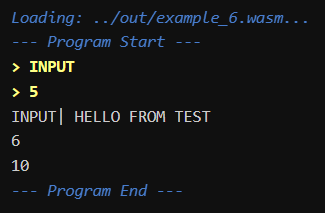

# Отчет

ФИО: Аврукевич Константин Сергеевич \
Группа: 221703 \
Вариант: 1

## Спецификация разработанного языка программирования

### Синтаксис объявления переменных:

1. Без присваивания (глобальные и локальные переменные): `<TYPE> <VAR_NAME>;`
2. С присваиванием (инициализация): `<TYPE> <VAR_NAME> = <EXPRESSION>;`

### Синтаксис объявления подпрограмм:

```
func <FUNCTION_NAME> (
    <PARAM_TYPE_1> <PARAM_NAME_1>, ..., <PARAM_TYPE_N> <PARAM_NAME_N>
) -> <RETURN_TYPE> {
    <FUNCTION_BODY>
}
```
*Примечание: Если функция ничего не возвращает, `<RETURN_TYPE>` указывается как `void`.*

### Синтаксис управляющих конструкций:

1. **for-statement**:
```
for (<INIT_STATEMENT>; <CONDITION_EXPRESSION>; <UPDATE_STATEMENT>) {
    <FOR_BODY>
}
```

2. **while-statement**:
```
while (<CONDITION_EXPRESSION>) {
    <WHILE_BODY>
}
```

3. **if-else-statement**:
```
if (<CONDITION_EXPRESSION>) {
    <IF_BODY>
} else {
    <ELSE_BODY>
}
```
*Примечание: Блок `else` опционален. Поддерживается вложенная конструкция `else if`.*

### Синтаксис операций над данными:

1. **Сложение** (арифметическое и конкатенация строк): `<EXPR> + <EXPR>`
2. **Вычитание**: `<EXPR> - <EXPR>`
3. **Умножение**: `<EXPR> * <EXPR>`
4. **Деление**: `<EXPR> / <EXPR>`
5. **Остаток от деления**: `<EXPR> % <EXPR>`
6. **Возведение в степень**: `<EXPR> ^ <EXPR>`
7. **Логическое И**: `<EXPR> and <EXPR>`
8. **Логическое ИЛИ**: `<EXPR> or <EXPR>`
9. **Логическое НЕ**: `not <EXPR>`
10. **Инкремент (префиксный/постфиксный)**: `++<VAR>` или `<VAR>++`
11. **Декремент (префиксный/постфиксный)**: `--<VAR>` или `<VAR>--`
12. **Операции сравнения**: 
    * Больше: `<EXPR> > <EXPR>`
    * Меньше: `<EXPR> < <EXPR>`
    * Больше или равно: `<EXPR> >= <EXPR>`
    * Меньше или равно: `<EXPR> <= <EXPR>`
    * Равно: `<EXPR> == <EXPR>`
    * Не равно: `<EXPR> != <EXPR>`
13. **Присваивание с операцией**: `+=`, `-=`, `*=`, `/=`
14. **Вызов функции**: `<FUNC_NAME>(<ARGS>)`
15. **Явное приведение типов**: `(<TARGET_TYPE>)<EXPR>`

## Описание грамматики

```antlr
grammar GrammarMathPL;

// Главное правило программы: список функций или глобальных выражений
program
    : (functionDefinition | statement)* EOF
    ;

// -----------------------------------------------
// ОБЪЯВЛЕНИЕ ФУНКЦИЙ
// -----------------------------------------------

// Определение функции: func name(params) -> type { block }
functionDefinition
    : FUNC ID LPAREN functionInParameters? RPAREN ARROW functionOutType block
    ;

// Список входящих параметров: type name, type name...
functionInParameters
    : type ID (COMMA type ID)*
    ;

// Аргументы при вызове: expr, expr...
functionArguments
    : expression (COMMA expression)*
    ;

// Тип возвращаемого значения (или void)
functionOutType
    : (type | VOID)
    ;

// Вызов функции как атомарное выражение
functionCall
    : ID LPAREN functionArguments? RPAREN
    ;

// -----------------------------------------------
// СТРУКТУРА КОДА
// -----------------------------------------------

// Блок кода в фигурных скобках
block
    : LBRACE (statement)* RBRACE
    ;

// Основные инструкции языка
statement
    : variableDeclaration     // Объявление переменной
    | variableAssignment      // Присваивание
    | ifStatement             // Условный оператор
    | forStatement            // Цикл for
    | whileStatement          // Цикл while
    | returnStatement         // Возврат из функции
    | functionCall SEMI       // Вызов функции как отдельная инструкция
    | incDecStatement         // Инкремент/декремент как инструкция
    ;

// Объявление переменной: type name = expr;
variableDeclaration
    : type ID (ASSIGN expression)? SEMI
    ;

// Присваивание: name = expr; или name += expr;
variableAssignment
    : ID (ASSIGN | PLUS_ASSIGN | MINUS_ASSIGN | MUL_ASSIGN | DIV_ASSIGN) expression SEMI
    ;

// Условный оператор if-else
ifStatement
    : IF LPAREN expression RPAREN THEN block
      ( ELSE ifStatement  // Поддержка else if
      | ELSE block
      )?
    ;

// Цикл while
whileStatement
    : WHILE LPAREN expression RPAREN block
    ;

// Цикл for: for(init; cond; update) { block }
forStatement
    : FOR LPAREN forInitializer SEMI expression? SEMI forUpdate? RPAREN block
    ;

// Инструкция инкремента/декремента: i++; или ++i;
incDecStatement
    : ID (INC | DEC) SEMI
    | (INC | DEC) ID SEMI
    ;

// Инициализация в for (только объявление или присваивание)
forInitializer
    : type ID ASSIGN expression
    ;

// Обновление в for (инкремент или присваивание)
forUpdate
    : ID (ASSIGN | PLUS_ASSIGN | MINUS_ASSIGN | MUL_ASSIGN | DIV_ASSIGN) expression
    | (INC | DEC) ID
    | ID (INC | DEC)
    ;

// Возврат значения
returnStatement
    : RETURN expression? SEMI
    ;

// -----------------------------------------------
// ВЫРАЖЕНИЯ (EXPRESSIONS)
// -----------------------------------------------

// Выражения с приоритетом операций
expression
    : atom                                            // Базовое значение
    | atom (INC | DEC)                                // Постфиксный инкремент
    | (INC | DEC) atom                                // Префиксный инкремент
    | NOT expression                                  // Логическое НЕ
    | expression POW expression                       // Степень ^
    | expression (MUL | DIV | MOD) expression         // Мультипликативные операции
    | expression (PLUS | MINUS) expression            // Аддитивные операции
    | expression (GT | LT | GTE | LTE | EQ | NEQ) expression // Сравнение
    | expression AND expression                       // Логическое И
    | expression OR expression                        // Логическое ИЛИ
    ;

// Атомарные элементы выражения
atom
    : LPAREN expression RPAREN    // Скобки
    | typeCast                    // Приведение типов
    | literal                     // Константы
    | variable                    // Переменные
    | functionCall                // Результат функции
    ;

// Явное приведение типа: (int)5.5
typeCast
    : LPAREN type RPAREN atom
    ;

// -----------------------------------------------
// ТИПЫ ДАННЫХ
// -----------------------------------------------

type
    : INT | FLOAT | BOOL | STRING
    ;

literal
    : INT_LITERAL | FLOAT_LITERAL | BOOL_LITERAL | STRING_LITERAL
    ;

variable
    : ID
    ;

// -----------------------------------------------
// ЛЕКСЕР (ТОКЕНЫ)
// -----------------------------------------------

INT: 'int';
FLOAT: 'float';
BOOL: 'bool';
STRING: 'str';
VOID: 'void';

WS: [ \t\r\n]+ -> skip;
COMMENT: '#' ~[\r\n]* -> skip;

LPAREN: '(';
RPAREN: ')';
LBRACE: '{';
RBRACE: '}';
SEMI: ';';
COMMA: ',';
ARROW: '->';

FUNC: 'func';
RETURN: 'return';
IF: 'if';
THEN: 'then';
ELSE: 'else';
WHILE: 'while';
FOR: 'for';
AND: 'and';
OR: 'or';
NOT: 'not';

BOOL_LITERAL: TRUE | FALSE;
TRUE: 'true';
FALSE: 'false';
ID: [a-zA-Z_] [a-zA-Z_0-9]*;
INT_LITERAL: '0' | [1-9] [0-9]*;
FLOAT_LITERAL: [0-9]+ '.' [0-9]+;
STRING_LITERAL: '"' ( '\\' . | ~[\\"] )* '"';

ASSIGN: '=';
PLUS_ASSIGN: '+=';
MINUS_ASSIGN: '-=';
MUL_ASSIGN: '*=';
DIV_ASSIGN: '/=';
INC: '++';
DEC: '--';
PLUS: '+';
MINUS: '-';
MUL: '*';
DIV: '/';
MOD: '%';
POW: '^';

GT: '>';
LT: '<';
GTE: '>=';
LTE: '<=';
EQ: '==';
NEQ: '!=';
```

## Описание разработанных классов

1.  **`MathPLSemanticAnalyzer`** (наследует `GrammarMathPLVisitor`):
    Основной класс семантического анализатора. Выполняет два прохода по AST (Abstract Syntax Tree):
    *   Проверяет корректность типов (строгая типизация).
    *   Управляет таблицей символов (области видимости переменных и функций).
    *   Аннотирует узлы дерева информацией о символах (`Symbol`) для генератора кода.
    *   Проверяет наличие `return` в функциях, корректность аргументов и допустимость операций.

2.  **`WatCodeGenerator`** (наследует `GrammarMathPLVisitor`):
    Класс генерации целевого кода в формате WebAssembly Text Format (`.wat`).
    *   Транслирует высокоуровневые конструкции языка (if, while, for) в блоки и переходы WASM.
    *   Управляет стеком операндов и локальными переменными WASM.
    *   Реализует арифметические и логические операции с учетом типов (`i32`, `f64`).
    *   Генерирует импорты встроенных функций (print, input, math).

3.  **`MathPLErrorListener`**:
    Класс для перехвата и накопления ошибок синтаксиса (от ANTLR) и семантики (от анализатора). Позволяет выводить информативные сообщения с указанием строки и позиции ошибки.

4.  **`Symbol`**, **`FunctionSymbol`**:
    Классы для представления метаданных о переменных и функциях. Хранят имя, тип данных (`MathPLType`), категорию (глобальная/локальная/параметр) и уникальный индекс для генерации кода.

5.  **`MathPLType`**, **`PrimitiveType`**:
    Система типов языка. Включает базовые типы (`INT`, `FLOAT`, `BOOL`, `STRING`, `VOID`) и механизмы проверки их совместимости.

## Перечень генерируемых ошибок

1.  **Синтаксические ошибки**: Автоматически генерируются парсером ANTLR при несоответствии кода грамматике.
2.  **Семантические ошибки**:
    1.  `Symbol '...' is already defined in this scope` — повторное объявление переменной.
    2.  `Symbol '...' is not defined` — использование необъявленной переменной или функции.
    3.  `Type mismatch` — попытка присвоить значение неверного типа (например, `int` в `bool`).
    4.  `Operator '...' requires numeric types` — применение арифметических операций к нечисловым типам.
    5.  `Operator '...' requires BOOL operands` — применение логических операций к небулевым типам.
    6.  `Comparison '...' is only allowed for numbers` — попытка сравнения `bool` или `str` через `>`, `<`.
    7.  `Invalid type cast` — недопустимое приведение типов.
    8.  `Function '...' expects N arguments, but got M` — неверное количество аргументов.
    9.  `Argument ... of '...': Expected type ..., but got ...` — неверный тип аргумента.
    10. `Non-void function must return a value` — отсутствие возвращаемого значения.
    11. `Return statement found outside of a function` — использование `return` в глобальной области.

## Демонстрация работы компилятора

### Пример 1: Безошибочный код

* **Исходный код (`correct_examples/example_6.txt`)**
```
func string_check(str in) -> void {
	print(in + "| HELLO FROM TEST");
	return;
}

func inc_dec_check(int i) -> int {
	int y;
	y = i++ + 5;
	print((str)i);
	return y;
}

str x = input();
int i = str_to_int(input());
string_check(x);
print((str)inc_dec_check(i));
```

* **Вывод через `wasm_runner/`**



### Пример 2: Ошибки с переменными и типами
* **Исходный код (`semantic_error_examples/error-examples_1.txt`)**

```
func scope_test() -> void {
    int x = 5;
    if (true) then {
        int y = 10;
    }
    x = y; # ОШИБКА: Переменная 'y' не определена в текущей области видимости
}

func undeclared_var() -> void {
    int val = z + 1; # ОШИБКА: Символ 'z' не определен
}

func type_mismatch() -> void {
    int num = "hello"; # ОШИБКА: Несоответствие типов при присваивании
    bool flag = 1;      # ОШИБКА: Несоответствие типов при присваивании
}

int a = 10;
int a = 20; # ОШИБКА: Переменная 'a' уже объявлена в этой области видимости
```

* **Вывод компилятора**

```
Starting syntax check for: ...\error-examples_1.txt
Syntax check successful.
Starting semantic analysis...
Compilation failed. Errors found:
  SEMANTIC ERROR on line 8:8 -> Symbol 'y' is not defined
  SEMANTIC ERROR on line 12:14 -> Symbol 'z' is not defined
  SEMANTIC ERROR on line 16:4 -> Type mismatch: Cannot assign expression of type 'STRING' to variable 'num' of type 'INT'
  SEMANTIC ERROR on line 17:4 -> Type mismatch: Cannot assign expression of type 'INT' to variable 'flag' of type 'BOOL'
  SEMANTIC ERROR on line 21:0 -> Symbol 'a' is already defined in this scope
```

### Пример 3: Ошибки в функциях
* **Исходный код (`semantic_error_examples/error-examples_3.txt`)**

```
func calculate(int a, int b) -> int {
    return a + b;
}

# ОШИБКА: Символ 'calculate' уже определен (перегрузка функций не поддерживается)
func calculate(int a) -> int {
    return a;
}

func call_errors() -> void {
    int sum = calculate(10); # ОШИБКА: Функция 'calculate' ожидает 2 аргумента, но получила 1

    calculate(10, "twenty"); # ОШИБКА: Аргумент 2: ожидался тип INT, но получен STRING
}

func wrong_return_type() -> float {
    return 10; # ОШИБКА: Функция должна возвращать FLOAT, но возвращает INT
}

func return_in_void() -> void {
    return 123; # ОШИБКА: Функция с типом VOID не должна возвращать значение
}
```

* **Вывод компилятора**

```
Starting syntax check for: ...\error-examples_3.txt
Syntax check successful.
Starting semantic analysis...
Compilation failed. Errors found:
  SEMANTIC ERROR on line 8:0 -> Symbol 'calculate' is already defined in this scope
  SEMANTIC ERROR on line 13:14 -> Function 'calculate' expects 2 arguments, but got 1
  SEMANTIC ERROR on line 15:18 -> Argument 2 of 'calculate': Expected type 'INT', but got 'STRING'
  SEMANTIC ERROR on line 19:4 -> Type mismatch: Function expects return type 'FLOAT' but got 'INT'
  SEMANTIC ERROR on line 23:4 -> Type mismatch: Function expects return type 'VOID' but got 'INT'
```

### Пример 4: Ошибки в объявлениях функций
* **Исходный код (`syntax_error_examples/error-examples_1.txt`)**

```
func get_zero(int dummy) void { # ОШИБКА: Пропущена стрелка '->'
    return 0;
}

func add(int a; int b) -> int { # ОШИБКА: Параметры должны разделяться запятой ','
    return a + b;
}
```

* **Вывод компилятора**

```text
[FAIL] error-examples_1.txt
      Starting syntax check for: ...\examples\syntax_error_examples\error-examples_1.txt
      Syntax check failed. Errors found:
        SYNTAX ERROR on line 3:25 -> missing '->' at 'void'
        SYNTAX ERROR on line 7:14 -> mismatched input ';' expecting ')'
        SYNTAX ERROR on line 7:21 -> mismatched input ')' expecting {';', '='}
        SYNTAX ERROR on line 7:30 -> mismatched input '{' expecting ID
        SYNTAX ERROR on line 9:0 -> extraneous input '}' expecting {<EOF>, 'int', 'float', 'bool', 'str', 'func', 'return', 'if', 'while', 'for', ID, '++', '--'}
```

### Пример 5: Ошибки в управляющих конструкциях
* **Исходный код (`syntax_error_examples/error-examples_3.txt`)**

```
func check(int a) -> bool {
    if (a > 0) { # ОШИБКА: Пропущено ключевое слово 'then'
        return true;
    }
    return false;
}

func loop() -> void {
    int i;
    for (i = 0; i < 10; i++) { # ОШИБКА: Инициализатор for должен объявлять новую переменную
        # ...
    }
}

func countdown() -> void {
    int i = 10;
    while i > 0 { # ОШИБКА: Условие цикла while должно быть в круглых скобках '(...)'
        i--;
    }
}
```

* **Вывод компилятора**

```text
[FAIL] error-examples_3.txt
      Starting syntax check for: ...\examples\syntax_error_examples\error-examples_3.txt
      Syntax check failed. Errors found:
        SYNTAX ERROR on line 4:15 -> missing 'then' at '{'
        SYNTAX ERROR on line 12:9 -> missing {'int', 'float', 'bool', 'str'} at 'i'
        SYNTAX ERROR on line 19:10 -> missing '(' at 'i'
        SYNTAX ERROR on line 19:16 -> missing ')' at '{'
```

